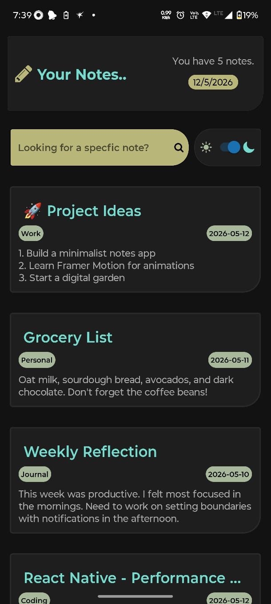
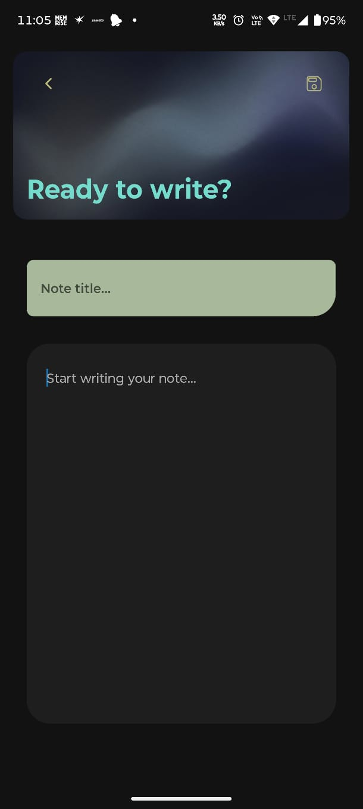

# Notes App UI

A clean and minimal Notes App UI built using React Native and Expo.

The project includes:

- Notes listing screen
- Search functionality
- Dark/light mode support
- Note editor screen
- Responsive layouts
- Reusable components

---

# Screenshots

## Notes Screen



## Editor Screen



---

# Tech Stack

- React Native
- Expo
- TypeScript
- Expo Router

---

# Features

- FlatList based notes display
- Search/filter notes
- Keyboard-aware editor screen
- ImageBackground header
- Theme support using `useColorScheme`
- Responsive UI using `useWindowDimensions`
- Floating action button navigation

---

# Routes

- `/` → Notes Listing Screen
- `/addNotesScreen` → Note Editor Screen

---

# Run Locally

```bash
npm install
npx expo start
```

---

# Future Improvements

- Persistent note storage
- Pinned notes
- Better animations
- Rich text support
